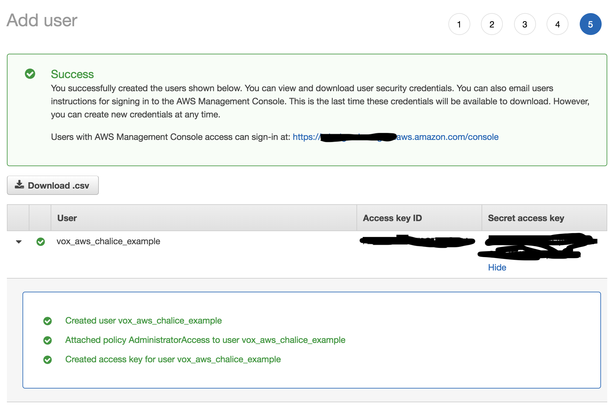
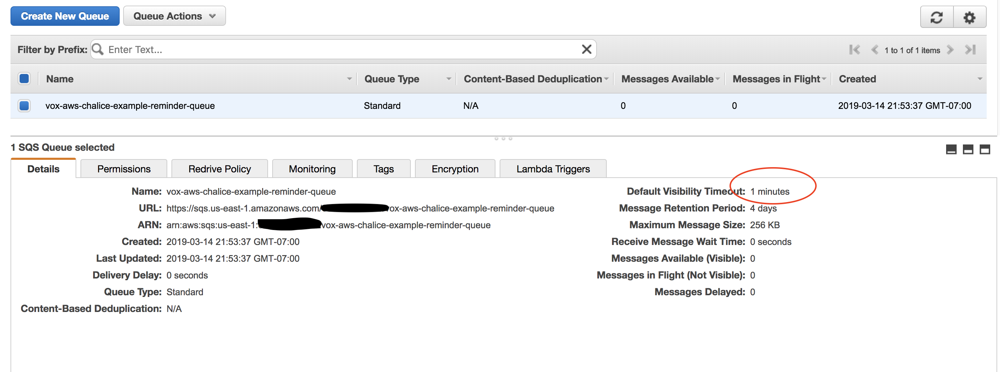
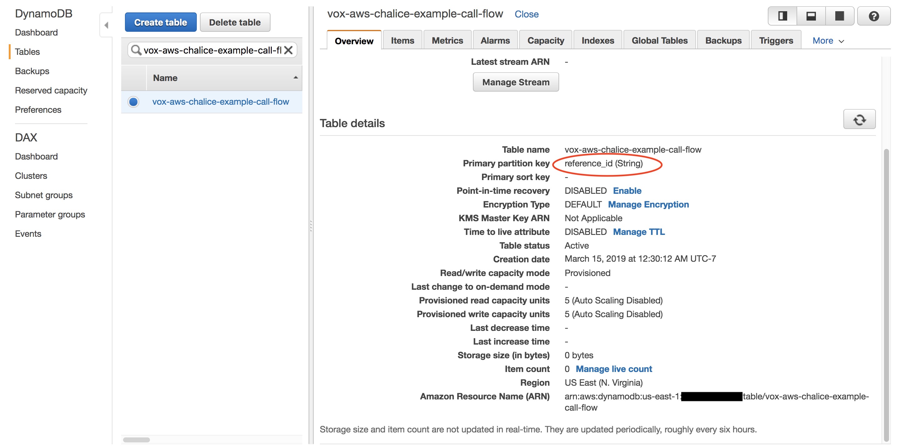
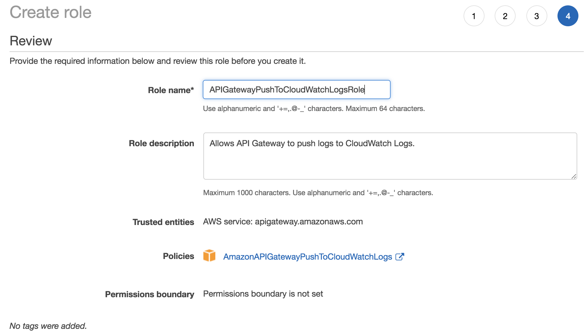
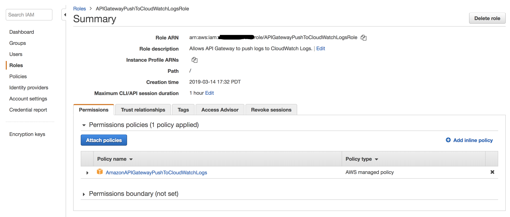
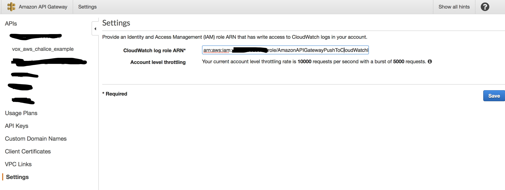
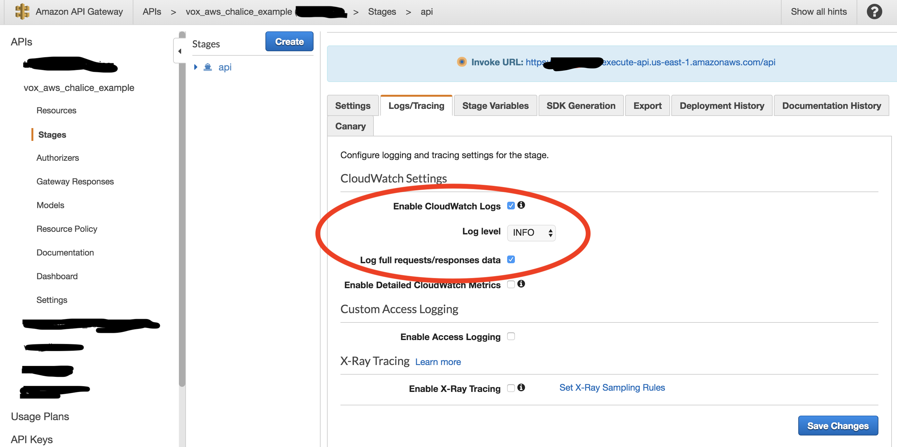
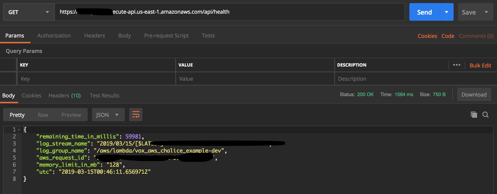
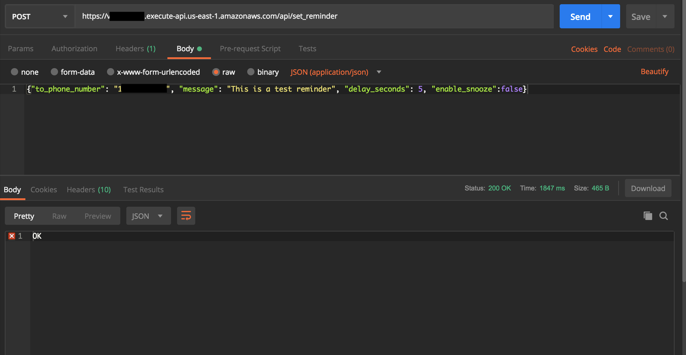
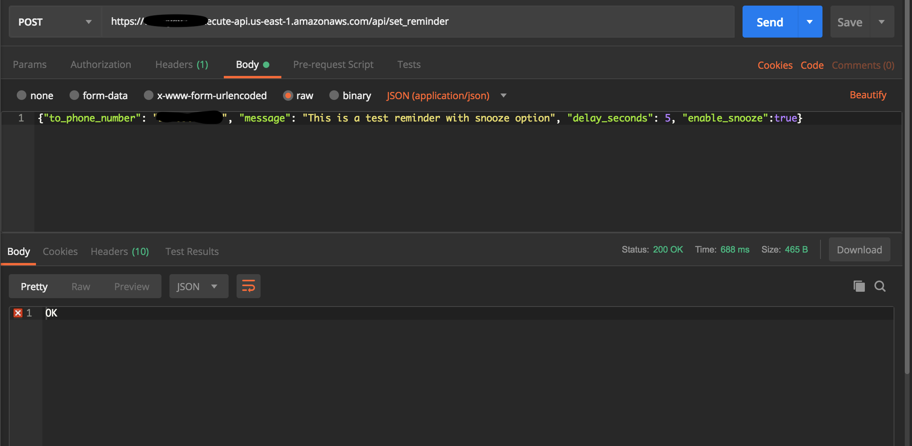

# Setup

1. Get TeleSign API Access Credential 

2. Update <code>telesign_customer_id</code>, <code>telesign_api_key</code>, <code>caller_ids</code> in <code>vox_aws_chalice_example/chalicelib/config.py</code>


3. Create an AWS user from IAM. For the sake of example purpose give it *AdministratorAccess*,
**just make sure you reassign the permission or remove the account after you are done playing with this** 



4. Add the AWS credential to your environment
```
export AWS_ACCESS_KEY_ID=your_access_key_id
export AWS_SECRET_ACCESS_KEY=your_secret_access_key
export AWS_REGION=your_aws_region
```

or via ~/.aws 

```
$ cd ~/.aws
$ ls
config      credentials

$ cat config
[default]
region = your_aws_region
 
$ cat credentials
[default]
aws_access_key_id = your_access_key_id
aws_secret_access_key = your_secret_access_key
```

5. Create SQS Queue for reminder 


6. Update <code>reminder_queue_name</code> in <code>vox_aws_chalice_example/chalicelib/config.py</code>

7. Create DynamoDB table <code>vox-aws-chalice-example-call-flow</code> with <code>reference_id</code> as Primary Key


8. Update <code>call_flow_dynamodb_table</code> in <code>vox_aws_chalice_example/chalicelib/config.py</code>

9. Create a virtualenv
```
~/sandbox/aws
$ mkvirtualenv --python=python3 vox_aws_chalice_example
Running virtualenv with interpreter /usr/local/bin/python3
Using base prefix '/usr/local/Cellar/python/3.7.1/Frameworks/Python.framework/Versions/3.7'
New python executable in /Users/your_username/.virtualenvs/vox_aws_chalice_example/bin/python3.7
Also creating executable in /Users/your_username/.virtualenvs/vox_aws_chalice_example/bin/python
Installing setuptools, pip, wheel...done.
...
...
...
(vox_aws_chalice_example) ~/sandbox/aws
$
```

10. Checkout the example code
```
(vox_aws_chalice_example) ~/sandbox/aws/
$ git clone {link here}
...
...
(vox_aws_chalice_example) ~/sandbox/aws/vox_aws_chalice_example  (master)
$
``` 

11. Install required packages
```
$ pip install -r requirements.txt
Collecting bahbahabah...
...
Installing collected packages: bahbahabah...
...
Successfully bahbahabah...
(vox_aws_chalice_example) ~/sandbox/aws/vox_aws_chalice_example  (master)
$
```

12. Deploy to AWS
```
(vox_aws_chalice_example) ~/sandbox/aws/vox_aws_chalice_example  (master)
$ chalice deploy
Creating deployment package.
Creating IAM role: vox_aws_chalice_example-dev
Creating lambda function: vox_aws_chalice_example-dev
Creating Rest API
Resources deployed:
  - Lambda ARN: arn:aws:lambda:us-east-1:123456789123:function:vox_aws_chalice_example-dev
  - Rest API URL: https://somehash.execute-api.us-east-1.amazonaws.com/api/
(vox_aws_chalice_example) ~/sandbox/aws/vox_aws_chalice_example  (master)
$
```

13. Create a role with AmazonAPIGatewayPushToCloudWatchLogs





14. Configure the API gateway to push log to CloudWatch





15. Health Check




16. Ask TeleSign Staff to register the call back url <code>https://somehash.execute-api.us-east-1.amazonaws.com/api/telesign_vox_callback</code>


17. Send a test reminder


18. Send a test reminder with snooze



# Note
This example is intended to demonstrate how to get start with TeleSign Vox API as quickly as possible. So much good software engineering practices are skipped (e.g. proper testing, authentication, authorization, etc).